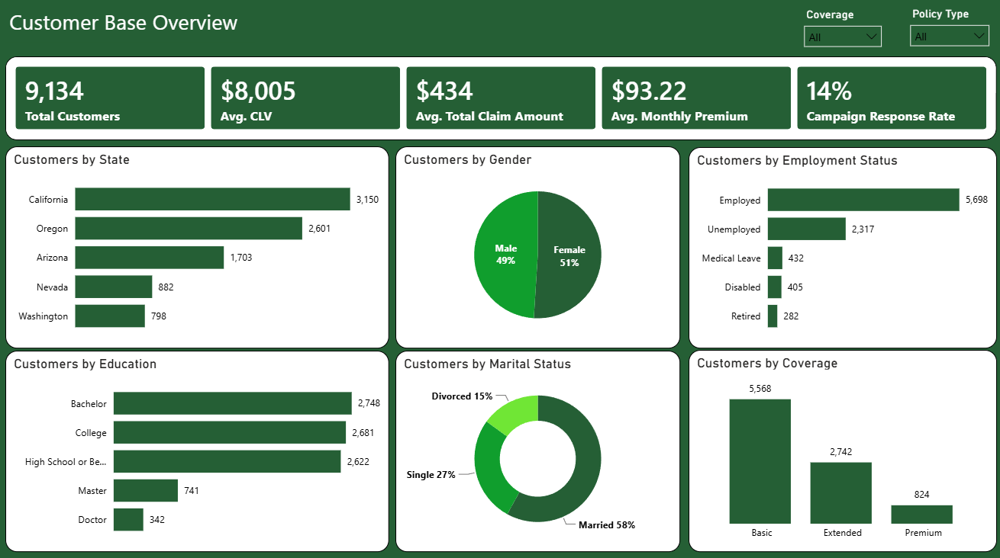
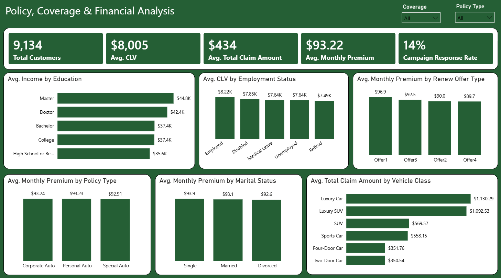
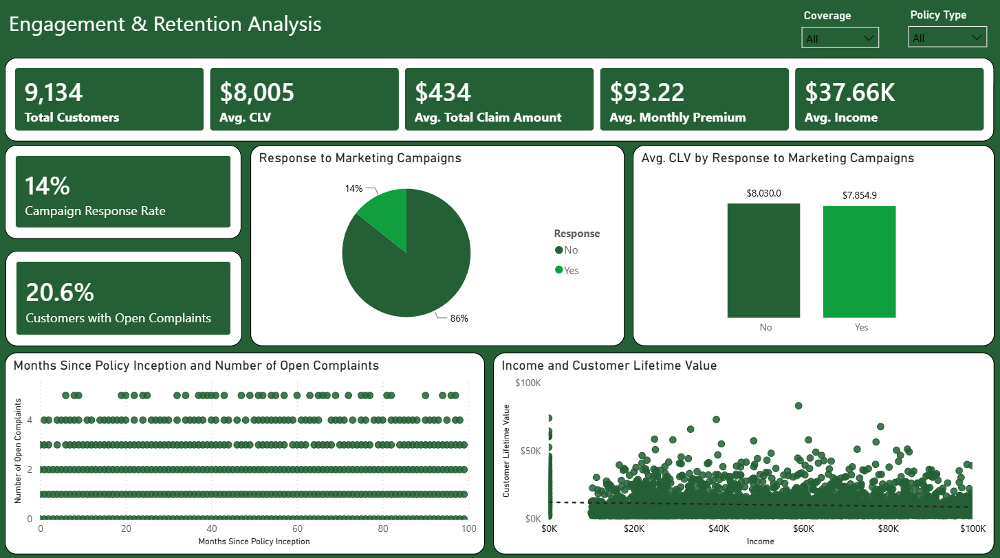
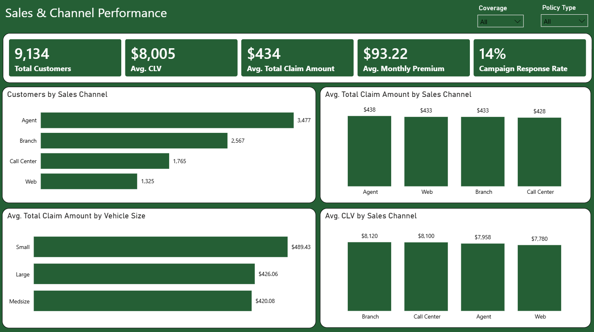

# Customer-Insights-Compass

# Profiling & Retention Analysis for an Auto Insurance Provider

A Power BI portfolio project analyzing 9,134 auto insurance customer records to uncover customer value drivers, retention risk, and sales channel performance — built from a Sales &amp; Marketing Analyst project brief (TFT Marketing Agency / Quantum Sphere scenario) as part of my Data Analytics &amp; Business Intelligence training.

# Project Overview

An auto insurance provider's Marketing and Sales teams needed a single, interactive view of their customer base to answer questions about customer value, retention, claims risk, and channel performance. This project turns a raw customer dataset into a 4-page Power BI dashboard and an executive summary, with the goal of identifying high-value customer profiles and informing renewal, upsell, and retention strategy.

Role: Data Analyst (self-directed training project) Scope: Data extraction → cleaning → modeling → dashboarding → executive reporting

# Business Objectives

Understand Customer Value — identify which segments (location, education, policy type) carry the highest Customer Lifetime Value (CLV).
Optimize Renewal Offers — determine which Renew Offer Type retains valuable customers and generates the strongest premiums.
Analyze Claims Behavior — investigate how customer and policy profiles relate to Total Claim Amount.
Improve Sales Channel Efficiency — compare Agent, Branch, Call Center, and Web on acquisition volume and customer value.
Inform Segmentation — surface insights for targeted marketing, personalized offers, and retention strategy.

# Tools Used

Data extraction	(SQL)

Data cleaning & preprocessing	(Excel - missing values, data types, categorical consistency)

Data modeling & visualization	(Power BI - Power Query, DAX)

Executive reporting	(PowerPoint)

# Dataset

9,134 customer records, 24 fields including: State, Customer Lifetime Value (CLV), Coverage, Education, Employment Status, Gender, Income, Marital Status, Monthly Premium, Months Since Last Claim, Months Since Policy Inception, Number of Open Complaints, Number of Policies, Policy Type, Renew Offer Type, Sales Channel, Total Claim Amount, Vehicle Class, Vehicle Size.

Cleaning steps: standardized categorical text (e.g., gender codes), validated data types (dates, numeric), and checked for missing values before modeling.

# Dashboards

The report has four linked pages, each filterable by Coverage and Policy Type.

# 1. Customer Base Overview

Headline metrics (total customers, avg. CLV, avg. claim, avg. premium, response rate) plus breakdowns by state, gender, employment status, education, marital status, and coverage tier.

# 2. Policy, Coverage & Financial Analysis

Average income by education, average CLV by employment status, average premium by renew offer and policy type, and average claim amount by vehicle class.

# 3. Engagement & Retention Analysis

Campaign response rate, CLV by response, open complaints rate, and scatter analysis of policy tenure vs. open complaints and income vs. CLV.

# 4. Sales & Channel Performance

Customer acquisition, average claim amount, and average CLV broken out by sales channel (Agent, Branch, Call Center, Web).

# Key Insights

1. Regional concentration: California and Oregon together account for ~63% of the customer base — a strong argument for regionally weighted campaigns. Coverage upsell runway: 61% of customers are still on Basic coverage, versus 30% Extended and 9% Premium.
2. Response doesn't equal value: customers who do not respond to marketing campaigns carry a slightly higher average CLV ($8,030) than those who do ($7,855) — campaign response history alone is not a reliable value signal.
3. Complaints aren't tied to tenure: open complaints (held by 20.6% of customers) are spread evenly across all levels of policy tenure, so early- or late-lifecycle targeting alone won't reach the right customers.
4. Vehicle class is the strongest claims driver: Luxury Cars and Luxury SUVs average approximately $1,090–$1,130 in claims — roughly 3x the amount for Two- and Four-Door cars (approximately $350).
5. Channel volume and value diverge: Agent brings in the most customers (38%), but Branch and Call Center customers carry the highest average CLV (~$8,100–$8,120), while Web trails on both counts.
6. Renew Offer 1 outperforms: it commands the highest average monthly premium ($96.9) of all four renewal offer types.

# Recommendations

1. Segment and retarget customers by policy count, coverage tier, and vehicle class rather than past campaign response.
2. Build a proactive outreach program for the ~1,882 customers with open complaints, independent of how long they've held a policy.
3. Invest in growing Branch and Call Center relationships; investigate why Web underperforms on both acquisition and value.
4. Target Basic-coverage customers for upsell to Extended/Premium tiers.
5. Review pricing/underwriting for Luxury and Small-vehicle segments given disproportionate claims.
6. Study what makes Renew Offer 1 effective and test extending its mechanics to other offers.

# Repository Structure

├── customer-insights-compass.pbix

├── customer-base-overview.png

├── policy-coverage-financial-analysis.png

├── engagement-retention-analysis.png

├── sales-channel-performance.png

├── TFT_Customer_Insights_Executive_Summary.pptx

└── README.md

# Skills Demonstrated

Data cleaning & preparation · SQL data extraction · Power Query · DAX measures · Data modeling · Dashboard design · Business insight generation · Executive communication

# About This Project

This is a training project completed as part of a Data Analytics & Business Intelligence program (RKY Careers), based on a Sales & Marketing Analyst project brief. The client (TFT Marketing Agency) and dataset scenario are used for practice purposes.

Yongo Kator Joseph [LinkedIn](www.linkedin.com/in/kator-yongo-4b248892) · [Portfolio](https://github.com/yongojkator-ai) · [Email](yongo.j.kator@gmail.com)
